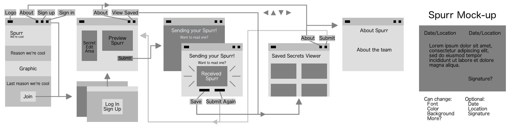

# Spurr

Your Personal Post Secret

## Team

  - __Product Owner__: Olivia Sabo-Rush (Frontend)
  - __Scrum Master__: Alice Lai (Backend)


# How it Works

> I have a secret I can't keep, but I can't tell anyone I know!

Great! Sign in and you'll be taken to our "confess" page, where you can create a Spurr from your secret and send it away!

> Where does it go?

Your Spurr will be sent to one separate user to enjoy! Only one person sees any given Spurr after it is sent, unless they want to save it!

> I want to read someone else's secrets too, but how?

Every time you send a Spurr, you get one to read in return!

> What happens when you save it?

Saving Spurrs adds them to your collection so that you can go back and view it whenever you want!

> I sent something bad, like illegal bad, can it be traced back to me?

Nope! We don't store who, when, or where the Spurr comes from, unless you want us to!

## Wireframe


## Get started with Spurr!

```
$ git clone https://github.com/Spurr-App/Spurr-App.git

$ cd Spurr-App

$ npm install

$ bower install

$ npm start
```
